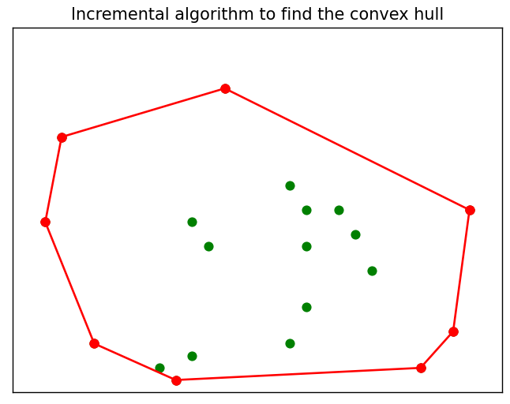

# Incremental algorithm to compute the convex hull of a set of 2D points.

Input: N number of points with random x- and y-coordinates (N is changable in l.74) \
Output: Plot (size can be changed in l.72 & l.73) with the convex hull of the points \
e.g.: \
